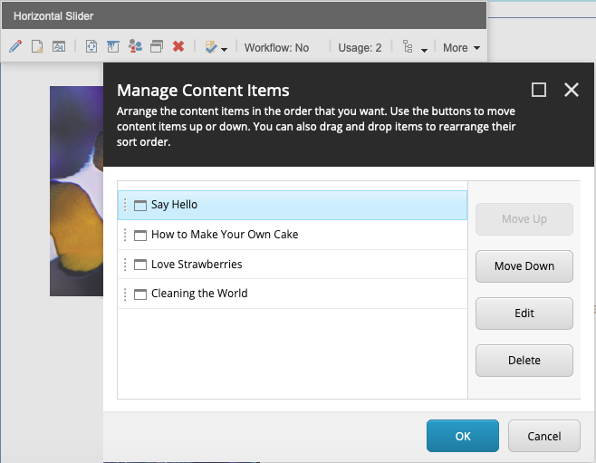
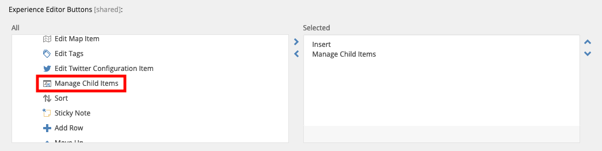
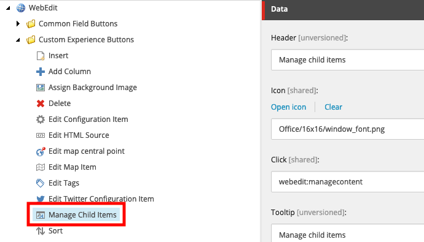

# Manage Child Items in Sitecore Experience Editor

## Usage
* Add command to your rendering item:

## Setup Instructions
* Repository contains both code and Sitecore item needed serialized with Unicorn. 
* If you don't want to synchronize item, just create a new one under `/sitecore/content/Applications/WebEdit/Custom Experience Buttons/Manage Child Items` with following fields:

